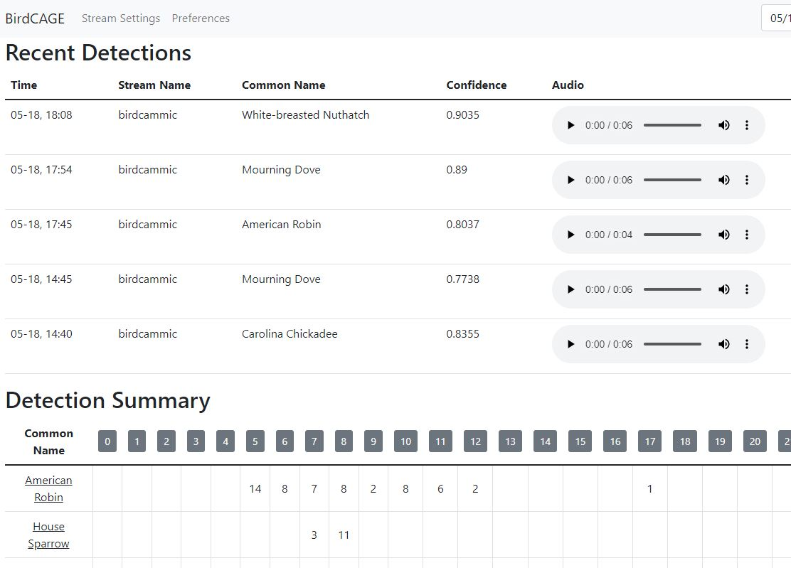

# Newest stuff
- I added functionality for setting up detection filters. I have not yet implemented the detection filters though.
    - As part of that you can see the birds the models thinks are likely to be around at your location this week.
    - Titled in French because I like the word "oiseaux".
- Had to make another change to BirdNET-Analyze. This time I had to change two of their Python files so I could
get a list of likely species and likelyhood scores for a given lat/long and week. I'm not utilizing it in the
BirdCAGE app yet but I intend to.
- Password control for stream settings and preferences. The default password is 'birdcage'. The UX is terrible.
- Details page with bigger spectrogram. My camera's audio has a pretty low sample rate, so the big spectrograms 
look not great. I hope to test with a CD quality (44.1KHz sampling, 16bit samples) source to see if it looks better

# BirdCAGE
BirdCAGE is an application for monitoring the bird songs in audio streams. Security cameras often provide
rtsp and rtmp streams that contain both video and audio. Feed the audio into BirdCAGE and see what sorts of birds are hanging around.

BirdCAGE was strongly inspired by BirdNET-Pi, but with the constraints of running in a Rasberry Pi removed. It utilizes
a slightly patched version of the analysis server provided by the BirdNET-Analyzer project. 

BirdCAGE is written in Python and was designed to be containerizable. It utilizes a separate back end and front end application.
The back end application records streams, calls the analysis server, stores results, and serves as an API server for the front end
application. The front end provides the UI. The back end application uses celery to spin up separate tasks for stream recording
and analyzing and analysis. A Redis container is used to coordinate the tasks.

## Here's what you're gonna do
- Go into the BirdNET-Analyzer directory. Do what it says there to get a BirdNET-Analyzer server running.
- Assuming you are using docker-compose, create a new directory on your server for the application. Put the docker-compose.yml
file from this repo in there. Create detections and db directories in there as well.
- Edit the docker-compose.yml file to meet your needs.
    - If you just want to view the UI from your intranet via IP addresses,
all you should have to do is replace 192.168.1.75 (in 3 places) with the IP address of your server.
    - If you want to be able to access it
from the internet, use your reverse proxy to give names to both the front end and back end (birdcage.yourdomain.com and
birdcageapi.yourdomain.com). Add the front end url to CORS_ORIGINS (e.g. CORS_ORIGINS: http://192.168.1.75:7008,http://birdcage.yourdomain.com)
and use back end name for API_SERVER_URL (e.g. API_SERVER_URL: http://birdcageapi.yourdomain.com).
    - ANALYZE_SERVER is the address for the BirdNET-Analyzer server you set up above. It can be an internal address - client
code never talks to it directly
- docker-compose up
- From the Web UI go to Stream Settings and add a stream. The default password is 'birdcage'. The Name field is for however you want the stream identified in the
UI. Address is the full url of the stream from your source (try opening it in VLC to make sure it works if you aren't sure).
Protocol is http, rtmp, or rtsp. Transport is TCP or UDP. This is only important for rtsp because it can use either one.
- Go to Preferences and set your latitude and longitude and tweak other settings. The default password is 'birdcage'. 
If you live in Topeka, Kansas you are
in luck: your latitude and longitude are already set.
- Consider changing the default password. Or don't.
- Did the above not work?
    - See if you can go to whatever you set as your API_SERVER_URL in your browser. You should see a (very incomplete) UI of API documentation.
    If not, the back end / API server is not exposed to the network correctly or the docket-compose file isn't configured correctly. Or both.
    - If that works, go back to the Preferences page, hit F12 and see if there are any client side scripting errors. All of the API
    calls are done in client side scriping in the browser to keep things snappy. If you are accessing the Web UI through a name via a reverse
    proxy, that name needs to be added to the CORS_ORIGINS environment variable in docker-compose.yml, you need to set a name for the back end/API server, and that name
    needs to be specified in the API_SERVER_URL environment variable in docker-compose.yml.
- Kill the BirdCAGE application (control C or docker-compose down). I don't have nice way to start recording from new streams yet.
- docker-compose up one more time. It should now start recording and analyzing

This is early days. Chances are things will break. Let me know what's broke in the Discussions or in an Issue or an angry
letter or whatever.

## To Do
- Add more features, e.g. block storing recordings of selected species. I don't need any more recordings of Robins.
- Handle changing streams and preferences without having to kill the app.
- I'm planning to work on a "sattelite recorder" based on the ESP32 platform. It'll probably need a different interface to upload audio
to avoid interference between the audio and WiFi.
